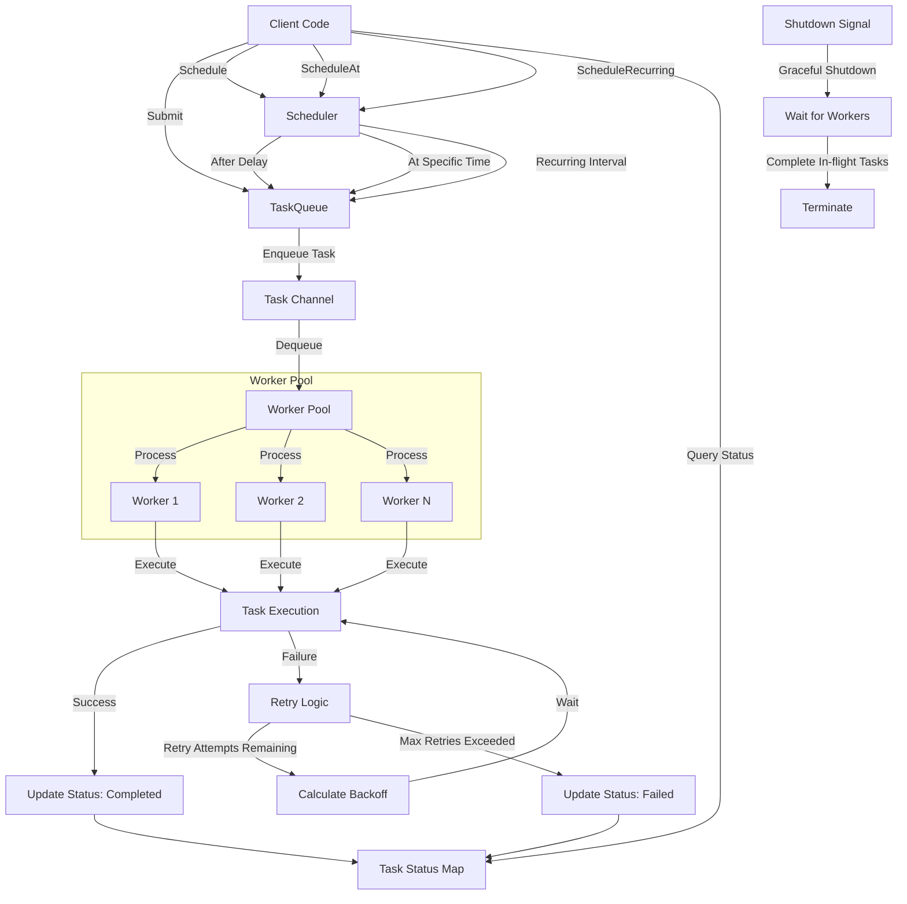

# 🚀 go_do_work

> A lightweight, in-memory task queue with powerful concurrency controls for Go applications.

[](https://golang.org/doc/go1.21)
[](LICENSE)

## 📋 Installation

```bash
go get github.com/dukebward/go_do_work
```

## ✨ Features

- **🔄 Concurrent Processing** - Configurable worker pool for parallel task execution
- **⏰ Flexible Scheduling** - Run tasks immediately, after a delay, or on a recurring schedule
- **🔁 Smart Retries** - Automatic retries with customizable backoff strategies
- **🔍 Task Tracking** - Monitor task status, attempts, and errors
- **🛑 Graceful Shutdown** - Clean termination with in-flight task completion

## 📊 Architecture

```
           ┌─────────────┐
 Submit -> │ Task Queue  │ -> Worker Pool (N goroutines)
           └─────────────┘
                  │
                  ▼
         ┌─────────────────┐
         │ Task Processing │ -> Retry Logic -> Status Tracking
         └─────────────────┘
```

### 🔄 Workflow Diagram



## 🚀 Quick Start

```go
// Create a task queue with 5 workers
taskQueue := queue.NewTaskQueue(
    queue.WithWorkerCount(5),
    queue.WithRetryPolicy(3, time.Second, time.Minute, queue.RetryFixed, nil),
)

// Submit a task
taskID, err := taskQueue.Submit(ctx, func(ctx context.Context) error {
    // Your task logic here
    return nil
})

// Check task status
info, err := taskQueue.Status(taskID)
fmt.Printf("Task status: %s\n", info.Status)

// Schedule a task to run after delay
scheduledID, err := taskQueue.Schedule(ctx, func(ctx context.Context) error {
    // Delayed task logic
    return nil
}, 5*time.Second)

// Graceful shutdown
err := taskQueue.Shutdown(ctx)
```

## 🔧 Configuration Options

| Option | Description | Default |
|--------|-------------|---------|
| `WithWorkerCount(n)` | Set number of concurrent workers | 1 |
| `WithQueueSize(n)` | Set maximum queue capacity | 100 |
| `WithBufferSize(n)` | Set channel buffer size | 100 |
| `WithRetryPolicy(maxRetries, baseDelay, maxDelay, strategy, shouldRetry)` | Configure retry behavior | See below |

### Retry Policy Configuration

The retry policy can be customized using the `WithRetryPolicy` option with the following parameters:

| Parameter | Description | Default |
|-----------|-------------|---------|
| `maxRetries` | Maximum number of retry attempts | 3 |
| `baseDelay` | Initial delay between retries | 1 second |
| `maxDelay` | Maximum delay between retries | 1 minute |
| `strategy` | Retry backoff strategy | `RetryFixed` |
| `shouldRetry` | Function that determines if an error should be retried | All errors are retried |

#### Available Retry Strategies

| Strategy | Description |
|----------|-------------|
| `RetryFixed` | Uses a fixed delay between retry attempts |
| `RetryExponential` | Increases delay exponentially between retry attempts |
| `RetryLinear` | Increases delay linearly between retry attempts |
| `RetryImmediate` | Retries immediately without any delay |

#### Example Configuration

```go
// Create a task queue with custom configuration
taskQueue := queue.NewTaskQueue(
    // Set 5 concurrent workers
    queue.WithWorkerCount(5),
    
    // Set queue capacity to 200 tasks
    queue.WithQueueSize(200),
    
    // Set channel buffer to 150
    queue.WithBufferSize(150),
    
    // Configure retry policy with exponential backoff
    queue.WithRetryPolicy(
        5,                      // 5 max retries
        500*time.Millisecond,   // 500ms base delay
        30*time.Second,         // 30s max delay
        queue.RetryExponential, // Exponential backoff
        func(err error) bool {  // Custom retry condition
            // Only retry specific errors
            return errors.Is(err, io.ErrUnexpectedEOF) || 
                   errors.Is(err, context.DeadlineExceeded)
        },
    ),
)
```

## 📖 API Reference

### Core Methods

- `Submit(ctx, task)` - Queue a task for immediate execution
- `Schedule(ctx, task, delay)` - Queue a task to run after a delay
- `ScheduleAt(ctx, task, time)` - Queue a task to run at a specific time
- `ScheduleRecurring(ctx, task, interval)` - Queue a recurring task
- `Status(taskID)` - Get current task status
- `Shutdown(ctx)` - Gracefully stop the queue

## 📄 License

MIT © [Luke Ward](https://github.com/dukebward)